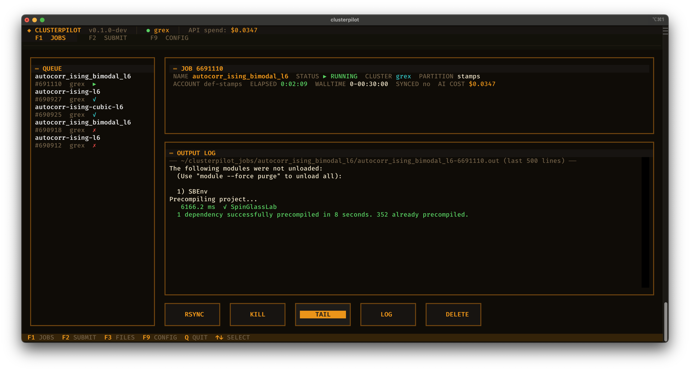
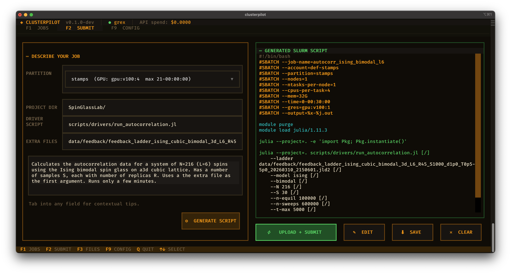
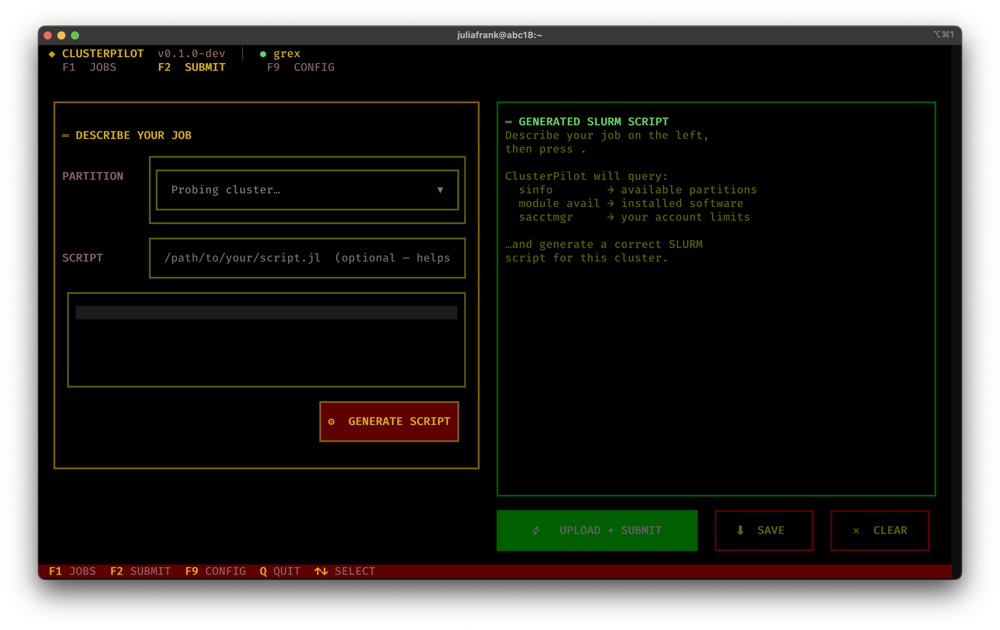
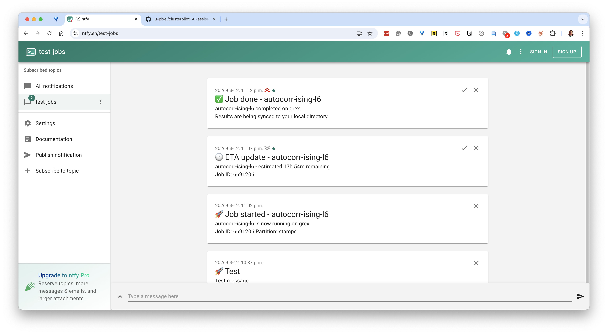

# ClusterPilot

AI-assisted HPC workflow manager for Compute Canada (DRAC) clusters and the
University of Manitoba's Grex cluster.

Built by a computational physics PhD student who got tired of doing this manually.

## What it does

ClusterPilot automates the full local to cluster to local research cycle:

1. **Describe your job in plain English** - ClusterPilot sends your description to an AI model to generate a correct, cluster-aware SLURM script
2. **Upload and submit** - files are rsynced to the cluster and `sbatch` is run over an existing SSH ControlMaster socket
3. **Monitor without babysitting** - a background poll daemon checks `squeue` every 5 minutes; no persistent SSH connection is held open
4. **Get notified** (optional) - push notifications to your phone on job start, completion, failure, and walltime warnings via [ntfy.sh](https://ntfy.sh)
5. **Auto-sync results** - on completion, output files are rsynced back to your local project directory

Everything runs from a keyboard-driven terminal UI (amber phosphor aesthetic, naturally).

<video src="https://github.com/user-attachments/assets/7bc688b2-9c35-4215-ae52-04750aaef889" autoplay loop muted playsinline></video>

### F2 — Describe your job and generate a SLURM script


### F1 — Monitor jobs, tail logs in real time, sync results



## Supported clusters

| Cluster | Type | Status |
|---------|------|--------|
| Grex (`yak.hpc.umanitoba.ca`) | UManitoba | v0.1 target |
| Cedar, Narval, Graham, Beluga | Compute Canada / DRAC | post-v1 |

## Requirements

- Python >= 3.9
- System `ssh` binary with ControlMaster support (standard on macOS/Linux)
- An API key for your chosen AI provider (currently Anthropic)
- (Optional) A free [ntfy.sh](https://ntfy.sh) topic for push notifications

## Installation

```bash
# pip
pip install clusterpilot

# conda
conda install -c conda-forge clusterpilot
```

On first run, ClusterPilot creates a starter config at
`~/.config/clusterpilot/config.toml`, prints its location, and exits.
Edit it to add your cluster username and account, then run `clusterpilot` again.

## Configuration

`~/.config/clusterpilot/config.toml`:

```toml
[defaults]
model = "claude-sonnet-4-6"   # AI model to use for script generation
api_key = ""                  # or set ANTHROPIC_API_KEY env var
poll_interval = 300           # seconds between job status checks

[[clusters]]
name = "grex"
host = "yak.hpc.umanitoba.ca"
user = "your_username"
account = "def-yoursupervisor"
scratch = "$HOME/clusterpilot_jobs"

[notifications]
backend = "ntfy"
ntfy_topic = "your-topic-string"
ntfy_server = "https://ntfy.sh"
```

### AI providers

| `provider` | `model` examples | API key |
|------------|-----------------|---------|
| `anthropic` (default) | `claude-sonnet-4-6`, `claude-opus-4-6` | `ANTHROPIC_API_KEY` env var or `api_key` in config |
| `openai` | `gpt-4o`, `gpt-4o-mini`, `o4-mini` | `OPENAI_API_KEY` env var or `api_key` in config |
| `ollama` | `llama3.2`, `qwen2.5-coder`, any local model | not required |

For Ollama, ClusterPilot connects to `http://localhost:11434` by default. To use a remote Ollama instance, set `api_base_url = "http://your-host:11434/v1"` in config.

Any OpenAI-compatible API (vLLM, LM Studio, etc.) also works with `provider = "openai"` and `api_base_url` pointing at the server.

To switch provider or model, edit `~/.config/clusterpilot/config.toml` directly, or press **EDIT CONFIG** on the F9 screen. Changes take effect on the next script generation; no restart needed.

### Adding multiple clusters

Add as many `[[clusters]]` blocks as you need. All configured clusters appear
in the cluster dropdown on the F2 Submit screen and are connected to
automatically on startup.

```toml
[[clusters]]
name = "grex"
host = "yak.hpc.umanitoba.ca"
user = "jsmith"
account = "def-supervisor"
scratch = "$HOME/clusterpilot_jobs"
cluster_type = "grex"

[[clusters]]
name = "narval"
host = "narval.alliancecan.ca"
user = "jsmith"
account = "def-supervisor"
scratch = "/scratch/jsmith"
cluster_type = "drac"

[[clusters]]
name = "myuni-hpc"
host = "hpc.myuniversity.edu"
user = "jsmith"
account = ""                     # omit if not required
scratch = "$HOME/jobs"
cluster_type = "generic"         # any other SLURM cluster
```

**`cluster_type` values:**

| Value | Use for |
|-------|---------|
| `generic` | Any SLURM cluster (default if omitted) |
| `drac` | Compute Canada / DRAC (Cedar, Narval, Graham, Beluga) |
| `grex` | University of Manitoba Grex (same as `generic` in practice) |

ClusterPilot probes `$SCRATCH` at connection time, so storage advice in
generated scripts is accurate for any cluster without manual configuration:

| What the probe finds | Storage advice injected into the AI prompt |
|---------------------|-------------------------------------------|
| `$SCRATCH` is set (e.g. `/scratch/jsmith`) | Use `$SCRATCH` for large output; `$SLURM_TMPDIR` for temp files |
| `$SCRATCH` is unset | Use `$HOME` or the job working directory; `$SLURM_TMPDIR` for temp files |
| `cluster_type = "drac"` (regardless of probe) | Hard rule: **never** `$HOME` (DRAC home quota is ~50 GB and jobs writing there get killed) |

The only reason to set `cluster_type = "drac"` is to get that hard warning.
For every other cluster, `generic` is correct; the probe handles the rest.

### Upload and download excludes

When uploading a project directory, ClusterPilot excludes files that are not
needed on the cluster. When downloading results, it skips source files that
are already on your machine and only pulls back output (SLURM logs, data
files, etc.).

Both lists are configurable in the `[defaults]` section:

```toml
[defaults]
# Files/dirs excluded from upload to the cluster.
upload_excludes = [
    ".git/",
    "__pycache__/",
    "*.pyc",
    "*.egg-info/",
    ".DS_Store",
    "CLAUDE.md",
    "clusterpilot_jobs/",
]

# Files/dirs excluded when syncing results back from the cluster.
# Everything not matched here is downloaded (SLURM logs, data output, etc.).
download_excludes = [
    "src/",
    "docs/",
    "examples/",
    "scripts/",
    "*.toml",
    "*.md",
    "*.sh",
    ".git/",
    "__pycache__/",
    ".DS_Store",
]
```

These are rsync glob patterns. If your job writes output to an unusual
location, adjust `download_excludes` to avoid filtering it out.

Per-project upload exclusions can also be set in a `.clusterpilot_ignore` file
at the project root (one pattern per line, same syntax as rsync `--exclude`).

## Usage

```bash
clusterpilot                 # launch the TUI
clusterpilot daemon run      # run the poll daemon in the foreground
clusterpilot daemon install  # install systemd user service (Linux)
```

### TUI screens

| Key | Screen |
|-----|--------|
| F1  | Job list - status, log tail, cancel |
| F2  | Submit - describe job, pick partition, generate + review script |
| F9  | Settings - clusters, SSH, notifications, API key |

### Submitting a job (F2 workflow)

1. Select your cluster from the dropdown
2. Select a partition (populated from a live `sinfo` cache)
3. Type a plain-language description of your job, e.g.:

   > Train a small transformer on CIFAR-10 using PyTorch, 1 V100, 4 hours

4. ClusterPilot generates a complete `sbatch` script - review and edit as needed
5. Press Submit - files are uploaded and the job is queued

The partition you select is passed to the model as a hard constraint, not a
suggestion. It will use the correct `--gres` syntax for that partition's hardware.

### Project directory mode

If you set **PROJECT DIR** on the F2 screen, the entire project tree is
rsynced to a job-specific directory on the cluster
(`$HOME/clusterpilot_jobs/<job-name>/`). Each job gets its own isolated copy,
so you can submit multiple jobs from the same local project without them
interfering with each other. Modify a parameter, change the driver script,
and submit again - each submission creates a fresh directory on the cluster.

When results are synced back, only output files are downloaded (SLURM logs,
data files). Source code that was uploaded is skipped by default. See
[Upload and download excludes](#upload-and-download-excludes) for details.

## How SSH works

ClusterPilot uses your system `ssh` binary with ControlMaster multiplexing.
You authenticate once (including MFA if required); all subsequent commands
reuse the existing socket with sub-second latency.

**No changes to `~/.ssh/config` are required.** ClusterPilot passes all
ControlMaster flags directly on the command line. Your existing SSH config
is left untouched.

## Terminal colours

ClusterPilot uses 24-bit RGB colour throughout. Most modern terminal emulators
support this, but the `COLORTERM` environment variable must be set to `truecolor`
for Textual to detect it. Without it, colours fall back to the nearest 16 ANSI
colours, which can look significantly different from the intended amber palette.

**macOS (iTerm2, Terminal.app):** truecolor works out of the box in a local
window. No action needed.

**Over SSH:** the `COLORTERM` variable is often not forwarded to the remote
session. Fix this by adding the following to `~/.bashrc` (or `~/.zshrc`) on
the remote machine:

```bash
export COLORTERM=truecolor
```

Then reconnect, or run `source ~/.bashrc` in the current session.

To verify:

```bash
echo $COLORTERM   # should print: truecolor
```

**iTerm2 users:** you can also forward the variable automatically for all SSH
sessions by adding `COLORTERM = truecolor` to the environment section of your
iTerm2 profile (Profiles → Session → Environment).

The left screenshot below shows correct truecolor rendering. The right shows
the 16-colour fallback over SSH without `COLORTERM` set — the amber backgrounds
are approximated as red by the terminal.

| Correct (truecolor) | 16-colour fallback over SSH |
|---|---|
|  |  |

## Mouse support over SSH

ClusterPilot is fully keyboard-navigable (Tab, arrow keys, Enter, F1/F2/F9)
and this is the recommended way to use it over SSH.

Mouse clicks work in local terminal windows and in most SSH sessions from
macOS terminals. However, **SSH into a Linux machine running Wayland** is a
known exception — mouse events are not reliably forwarded through the SSH
connection in this configuration, regardless of terminal settings. This is a
Wayland limitation, not a ClusterPilot bug, and affects most TUI applications.

**Workaround:** run ClusterPilot directly on the local machine and point it at
the remote cluster via SSH ControlMaster, which is the intended workflow. If
you need to run it on a remote Linux workstation, switching that session to an
X11 fallback (`ssh -X`) may restore mouse support.

## Notifications (optional)



Push notifications are **entirely optional**. If you prefer to just leave
the TUI open and check job status from the F1 screen, that works perfectly
well. The SSH connection stays alive as long as the TUI is running
(`ControlPersist 4h` + `ServerAliveInterval 60`), the job list refreshes
automatically every 10 seconds, and you can press TAIL or LOG at any time
to see live output. No external service is needed for this workflow.

If you want push notifications to your phone (useful when you close
the lid and walk away), ClusterPilot supports [ntfy.sh](https://ntfy.sh).

### Setting up ntfy (if you want it)

1. **Pick a topic string** - this is just a name, like a channel.
   Use something unique so strangers cannot read your notifications
   (e.g. `clusterpilot-jfrank-a8f3`, not `test-jobs`).

2. **Add it to your config** (`~/.config/clusterpilot/config.toml`):

   ```toml
   [notifications]
   backend = "ntfy"
   ntfy_topic = "clusterpilot-jfrank-a8f3"   # your unique topic
   ntfy_server = "https://ntfy.sh"           # or a self-hosted server
   ```

3. **Subscribe on your phone** - install the ntfy app
   ([Android](https://play.google.com/store/apps/details?id=io.heckel.ntfy) /
   [iOS](https://apps.apple.com/app/ntfy/id1625396347)) and subscribe to
   the same topic string. No account or phone number is required.

That's it. You can also view notifications in a browser at
`https://ntfy.sh/your-topic-string`.

### Disabling notifications

Leave `ntfy_topic` empty (or remove it) and no notifications will be sent:

```toml
[notifications]
backend = "ntfy"
ntfy_topic = ""
```

### Notification events

When enabled, ClusterPilot notifies on:

- Job started (PENDING to RUNNING)
- Job completed - results are syncing
- Job failed - includes the last 6 lines of the SLURM log
- Walltime warning - less than 30 minutes remaining
- ETA update - periodic estimate while running

A self-hosted ntfy server or any HTTP POST webhook also works; set
`ntfy_server` in the config accordingly.

## Architecture

```
clusterpilot/
  ssh/           system ssh/rsync subprocess wrappers (ControlMaster)
  cluster/       sinfo/module avail probe + 24h JSON cache
  jobs/          AI script generation, sbatch submit, state machine
  notify/        ntfy.sh HTTP push
  daemon/        async poll loop + systemd service installer
  tui/           Textual app (F1 jobs / F2 submit / F9 settings)
  config.py      ~/.config/clusterpilot/config.toml loader
  db.py          aiosqlite job history
```

All cluster-specific SLURM quirks (account requirements, scratch paths, GPU
syntax) live in one place and are injected into the AI prompt automatically.

## Development

```bash
git clone https://github.com/ju-pixel/clusterpilot
cd clusterpilot
python -m venv .venv && source .venv/bin/activate
pip install -e ".[dev]"

pytest          # 128 tests, no SSH required
ruff check .    # lint
```

## Planned

- ~~Remote cleanup from F1: delete synced/terminal job directories on the cluster
  to reclaim scratch space without SSH-ing in manually~~
- ~~Support for additional AI providers (OpenAI, local models via Ollama, etc.)~~
- ~~Job array support in the submission UI~~
- ~~conda-forge package for HPC environments that prefer conda~~
- ~~Cost estimation before submission based on requested resources and account allocation~~
- Hosted tier with managed API key and web dashboard
- Windows support (WSL2 path handling, no systemd dependency)

## Support

ClusterPilot is free and open source. If it saves you time,
consider [sponsoring development](https://github.com/sponsors/ju-pixel).

## Licence

MIT - free to use and self-host.

A hosted tier (managed API key, web dashboard) is planned for researchers who
want zero setup. Subscribing will also support continued development. The
self-hosted version will always be fully functional.
