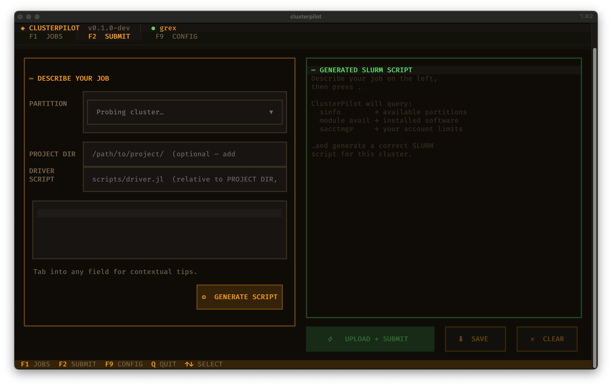

# ClusterPilot

AI-assisted HPC workflow manager for Compute Canada (DRAC) clusters and the
University of Manitoba's Grex cluster.

Built by a computational physics PhD student who got tired of doing this manually.

## What it does

ClusterPilot automates the full local to cluster to local research cycle:

1. **Describe your job in plain English** - ClusterPilot sends your description to an AI model to generate a correct, cluster-aware SLURM script
2. **Upload and submit** - files are rsynced to the cluster and `sbatch` is run over an existing SSH ControlMaster socket
3. **Monitor without babysitting** - a background poll daemon checks `squeue` every 5 minutes; no persistent SSH connection is held open
4. **Get notified** - push notifications to your phone on job start, completion, failure, and walltime warnings via [ntfy.sh](https://ntfy.sh)
5. **Auto-sync results** - on completion, output files are rsynced back to your local project directory

Everything runs from a keyboard-driven terminal UI (amber phosphor aesthetic, naturally).



## Supported clusters

| Cluster | Type | Status |
|---------|------|--------|
| Grex (`yak.hpc.umanitoba.ca`) | UManitoba | v0.1 target |
| Cedar, Narval, Graham, Beluga | Compute Canada / DRAC | post-v1 |

## Requirements

- Python >= 3.9
- System `ssh` binary with ControlMaster support (standard on macOS/Linux)
- An API key for your chosen AI provider (currently Anthropic)
- A free [ntfy.sh](https://ntfy.sh) topic (or self-hosted ntfy server)

## Installation

```bash
pip install clusterpilot
```

Then run the setup wizard:

```bash
clusterpilot init
```

This creates `~/.config/clusterpilot/config.toml` and installs the systemd
poll daemon (Linux) or equivalent.

## Configuration

`~/.config/clusterpilot/config.toml`:

```toml
[defaults]
model = "claude-sonnet-4-6"   # AI model to use for script generation
api_key = ""                  # or set ANTHROPIC_API_KEY env var
poll_interval = 300           # seconds between job status checks

[[clusters]]
name = "grex"
host = "yak.hpc.umanitoba.ca"
user = "your_username"
account = "def-yoursupervisor"
scratch = "$HOME/clusterpilot_jobs"

[notifications]
backend = "ntfy"
ntfy_topic = "your-topic-string"
ntfy_server = "https://ntfy.sh"
```

The API key can also be provided via the `ANTHROPIC_API_KEY` environment
variable instead of the config file.

## Usage

```bash
clusterpilot          # launch the TUI
clusterpilot daemon   # run the poll daemon in the foreground
```

### TUI screens

| Key | Screen |
|-----|--------|
| F1  | Job list - status, log tail, cancel |
| F2  | Submit - describe job, pick partition, generate + review script |
| F9  | Settings - clusters, SSH, notifications, API key |

### Submitting a job (F2 workflow)

1. Select your cluster from the dropdown
2. Select a partition (populated from a live `sinfo` cache)
3. Type a plain-language description of your job, e.g.:

   > Train a small transformer on CIFAR-10 using PyTorch, 1 V100, 4 hours

4. ClusterPilot generates a complete `sbatch` script - review and edit as needed
5. Press Submit - files are uploaded and the job is queued

The partition you select is passed to the model as a hard constraint, not a
suggestion. It will use the correct `--gres` syntax for that partition's hardware.

## How SSH works

ClusterPilot uses your system `ssh` binary with ControlMaster multiplexing.
You authenticate once (including MFA if required); all subsequent commands
reuse the existing socket with sub-second latency.

`clusterpilot init` writes the appropriate `Host` block to `~/.ssh/config`:

```
Host grex
    HostName yak.hpc.umanitoba.ca
    ControlMaster auto
    ControlPath ~/.ssh/cm_%h_%p_%r
    ControlPersist 4h
    ServerAliveInterval 60
```

## Terminal colours

ClusterPilot uses 24-bit RGB colour throughout. Most modern terminal emulators
support this, but the `COLORTERM` environment variable must be set to `truecolor`
for Textual to detect it. Without it, colours fall back to the nearest 16 ANSI
colours, which can look significantly different from the intended amber palette.

**macOS (iTerm2, Terminal.app):** truecolor works out of the box in a local
window. No action needed.

**Over SSH:** the `COLORTERM` variable is often not forwarded to the remote
session. Fix this by adding the following to `~/.bashrc` (or `~/.zshrc`) on
the remote machine:

```bash
export COLORTERM=truecolor
```

Then reconnect, or run `source ~/.bashrc` in the current session.

To verify:

```bash
echo $COLORTERM   # should print: truecolor
```

**iTerm2 users:** you can also forward the variable automatically for all SSH
sessions by adding `COLORTERM = truecolor` to the environment section of your
iTerm2 profile (Profiles → Session → Environment).

The left screenshot below shows correct truecolor rendering. The right shows
the 16-colour fallback over SSH without `COLORTERM` set — the amber backgrounds
are approximated as red by the terminal.

| Correct (truecolor) | 16-colour fallback over SSH |
|---|---|
|  |  |

## Notifications

ClusterPilot sends push notifications via [ntfy.sh](https://ntfy.sh). No
account is needed - just pick a topic string and subscribe to it on your
phone using the ntfy app.

Events that trigger notifications:

- Job started (PENDING to RUNNING)
- Job completed - results are syncing
- Job failed - includes the last 6 lines of the SLURM log
- Walltime warning - when less than ~10 minutes remain
- ETA update - periodic estimate while running

A self-hosted ntfy server or any HTTP POST webhook also works; set
`ntfy_server` in the config accordingly.

## Architecture

```
clusterpilot/
  ssh/           system ssh/rsync subprocess wrappers (ControlMaster)
  cluster/       sinfo/module avail probe + 24h JSON cache
  jobs/          AI script generation, sbatch submit, state machine
  notify/        ntfy.sh HTTP push
  daemon/        async poll loop + systemd service installer
  tui/           Textual app (F1 jobs / F2 submit / F9 settings)
  config.py      ~/.config/clusterpilot/config.toml loader
  db.py          aiosqlite job history
```

All cluster-specific SLURM quirks (account requirements, scratch paths, GPU
syntax) live in one place and are injected into the AI prompt automatically.

## Development

```bash
git clone https://github.com/ju-pixel/clusterpilot
cd clusterpilot
python -m venv .venv && source .venv/bin/activate
pip install -e ".[dev]"

pytest          # 128 tests, no SSH required
ruff check .    # lint
```

## Planned

- Support for additional AI providers (OpenAI, local models via Ollama, etc.)
- Graham and Beluga (Compute Canada) cluster profiles
- Job array support in the submission UI
- Hosted tier with managed API key and web dashboard
- conda-forge package for HPC environments that prefer conda
- Windows support (WSL2 path handling, no systemd dependency)
- Cost estimation before submission based on requested resources and account allocation

## Licence

MIT - free to use and self-host.

A hosted tier (managed API key, web dashboard) is planned for researchers who
want zero setup. Subscribing will also support continued development. The
self-hosted version will always be fully functional.
